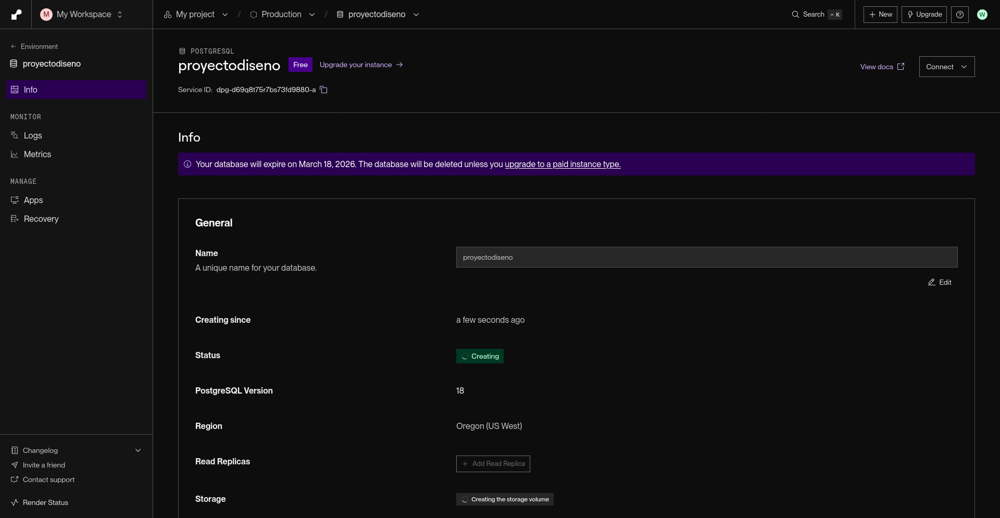
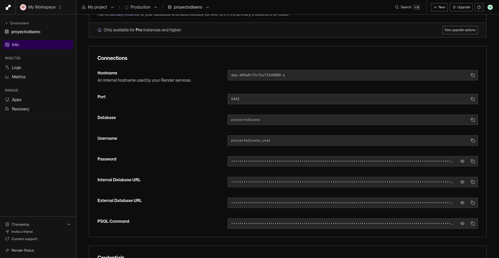
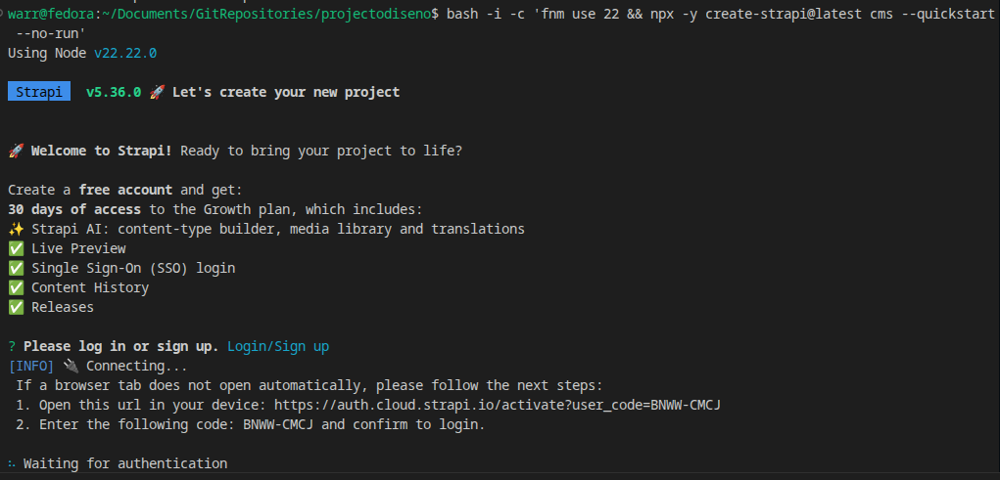
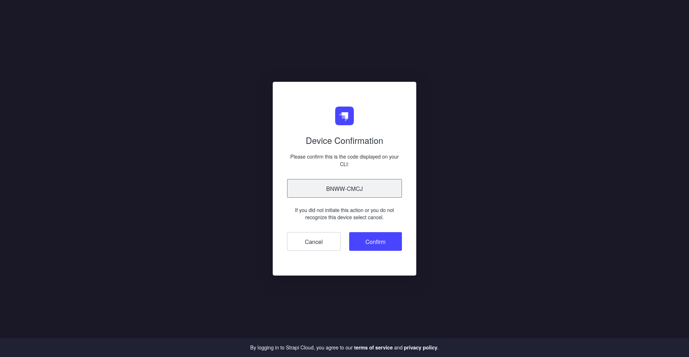
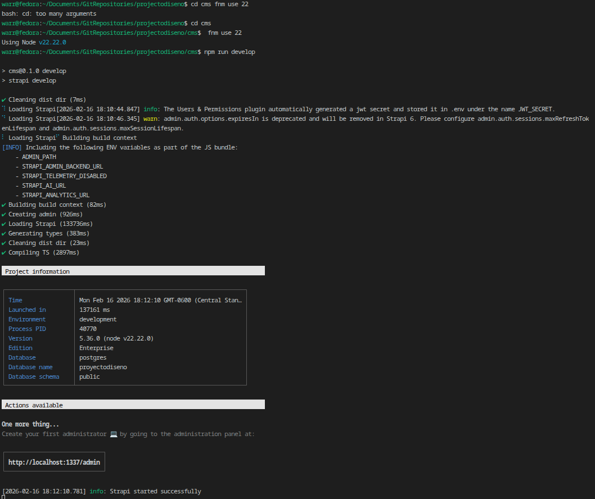

# Guía Didáctica N° 4: CMS Headless con Strapi & Render

Este documento detalla la transición hacia un CMS Headless utilizando Strapi y la configuración de una base de datos PostgreSQL en Render, siguiendo los objetivos de la Guía Didáctica N° 4.

## 1. Conceptos Fundamentales
Se investigó la arquitectura de un CMS Headless, la cual separa la gestión de contenido (Backend/Admin) de la presentación (Frontend), permitiendo consumir los datos vía API.

> [!NOTE]
> **Aclaración de Compatibilidad**: Se recomienda el uso de versiones **LTS (v20 o v22)** de Node.js. Esto no representa un riesgo para dependencias como Prisma; al contrario, asegura la máxima compatibilidad y estabilidad, ya que estas versiones son el estándar de prueba para la mayoría de las bibliotecas modernas.

## 2. Configuración de Infraestructura (Render)
Se preparó el entorno para utilizar PostgreSQL:
- **Plataforma**: [Render.com](https://render.com/)
- **Servicio**: PostgreSQL (Plan Hobby)
- **Conectividad**: Se configuraron las credenciales en el archivo `.env` del proyecto CMS.

## 3. Decisiones Arquitectónicas y "Breaking Changes"
Para esta guía se tomó la decisión crítica de instalar Strapi en una subcarpeta dedicada (`cms/`) en lugar de la raíz del proyecto. Instalar Strapi directamente en la raíz habría provocado **Breaking Changes** irreversibles para el trabajo realizado en las Guías 1, 2 y 3 debido a:

- **Conflicto de Dependencias**: Strapi y NestJS utilizan archivos idénticos (`package.json`, `tsconfig.json`, `node_modules`). Una instalación en la raíz sobreescribiría las dependencias y configuraciones de NestJS, rompiendo el CRUD y la autenticación previa.
- **Variables de Entorno**: Ambos sistemas dependen de un archivo `.env`. Al mezclarlos, las variables de conexión a la DB entrarían en conflicto.
- **Estructura del Repositorio**: El uso de la carpeta `/cms` permite que ambos servicios (NestJS y Strapi) coexistan, permitiendo al desarrollador trabajar en ambos de forma independiente sin pérdida de datos.

## 4. Gestión del Entorno (Node.js)
Dada la incompatibilidad de Strapi con Node v25 (versión actual en el sistema), se realizaron los siguientes pasos técnicos para asegurar la estabilidad:

1. **Instalación de Versión LTS**: Se utilizó `fnm` (Fast Node Manager) para instalar la versión recomendada.
   ```bash
   fnm install 22
   ```
2. **Cambio de Contexto**: Se activó la versión v22 para el proceso de creación.
   ```bash
   fnm use 22
   ```
3. **Comando de Creación**:
   ```bash
   bash -i -c 'fnm use 22 && npx -y create-strapi@latest cms --quickstart --no-run'
   ```

## 4. Configuración del Entorno (.env.example.renderer)
Se creó una plantilla de configuración para facilitar la vinculación con Render:
#### Archivo: `.env.example.renderer`
```env
DATABASE_CLIENT=postgres
DATABASE_HOST=xxxx.oregon-postgres.render.com
DATABASE_PORT=5432
DATABASE_NAME=projecto_db
DATABASE_USERNAME=user
DATABASE_PASSWORD=password
DATABASE_SSL=true
```

## 5. Modelado de Datos: Recurso "Estudiante"
Se definió la estructura de la colección para gestionar estudiantes:
- **Colección**: `Estudiante`
- **Campos sugeridos**:
  - `Nombre` (Text)
  - `Apellido` (Text)
  - `Edad` (Number)

## 6. Próximos Pasos
- Finalizar el modelado de la colección en el Panel de Administración.
- Realizar pruebas de inserción de datos.
- Verificar el tráfico y logs en la instancia de Render.

## 7. Evidencia Visual

**Render BD postgres:**


**Render BD config:**


**strapi create project:**


**strapi confirmation:**


**strapi running:**


---
*Este avance marca el inicio de la gestión de contenido desacoplada y el uso de bases de datos relacionales en la nube.*
